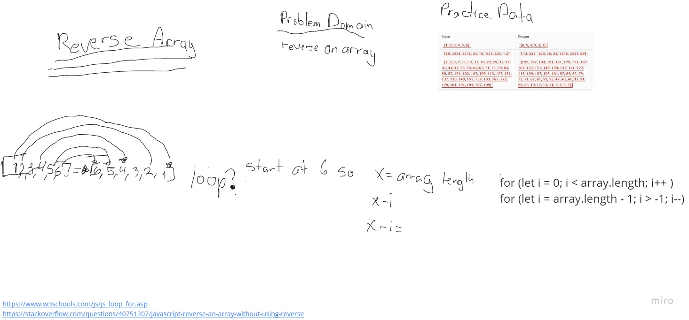

# Reverse an Array
white board a process to reverse an array elements without using predefined methods.

## Whiteboard Process

## Approach & Efficiency
I figured my only option was some form of loop that would select elements and then push them into a new array.

## credits
https://www.w3schools.com/js/js_loop_for.asp
https://stackoverflow.com/questions/40751207/javascript-reverse-an-array-without-using-reverse